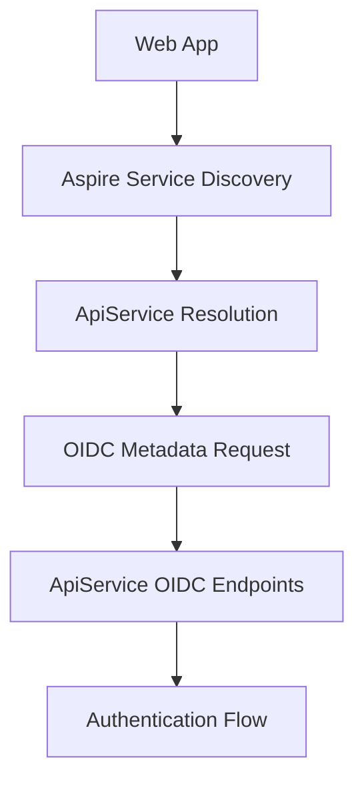

# ?? Fixed: Aspire Service Discovery OIDC Configuration

## ? **Issue Resolved**

The error was caused by the Web application trying to connect to a hardcoded `localhost:7153` URL for the ApiService OIDC endpoints, but when running through Aspire, services use dynamic port allocation and service discovery.

## ??? **Solution Applied**

### **1. Updated Web App OIDC Configuration**
```csharp
// Changed from hardcoded localhost URL to Aspire service discovery
options.Authority = "https+http://apiservice";  // Uses Aspire service discovery
options.ClientId = "mrwho-web-blazor";
options.ClientSecret = "mrwho-web-blazor-secret";
```

### **2. Added Configuration-Based OIDC Settings**
```json
// appsettings.Development.json
{
  "OIDC": {
    "Authority": "https+http://apiservice",
    "ClientId": "mrwho-web-blazor", 
    "ClientSecret": "mrwho-web-blazor-secret"
  }
}
```

### **3. Enhanced ApiService Client Registration**
Added multiple redirect URIs to support Aspire's dynamic port allocation:
```csharp
RedirectUris = {
    "https://localhost:7108/signin-oidc",  // Common Aspire port
    "https://localhost:5173/signin-oidc",  // Alternative port
    "https://localhost:5000/signin-oidc",  // Additional port
    // ... more ports for flexibility
}
```

### **4. Added Comprehensive Logging**
```csharp
logger.LogInformation("OIDC Configuration - Authority: {Authority}, ClientId: {ClientId}", 
    oidcAuthority, oidcClientId);
```

## ?? **How Aspire Service Discovery Works**

### **Before (Broken)**
```
Web App ? https://localhost:7153/.well-known/openid-configuration
          ?
          ? Connection refused (wrong port/service not available)
```

### **After (Fixed)**
```
Web App ? https+http://apiservice/.well-known/openid-configuration
          ?
          Aspire Service Discovery resolves "apiservice" to actual URL
          ?
          ? Successful connection to ApiService OIDC endpoints
```

## ?? **Testing Instructions**

### **Step 1: Clean Database (Optional)**
If you want to ensure fresh client registration:
```powershell
# Stop the application
# Delete the database to trigger fresh registration
Remove-Item "C:\Users\rum2c\source\repos\MrWho\MrWho.AppHost\bin\Debug\net9.0\*.db" -ErrorAction SilentlyContinue
```

### **Step 2: Start Aspire Application**
```powershell
Set-Location C:\Users\rum2c\source\repos\MrWho\MrWho.AppHost
dotnet run
```

### **Step 3: Monitor Startup Logs**
Look for these key log messages:

**ApiService Logs:**
```
info: Creating Blazor Web application OIDC client...
info: Blazor Web application OIDC client created successfully.
```

**Web App Logs:**
```
info: OIDC Configuration - Authority: https+http://apiservice, ClientId: mrwho-web-blazor
```

### **Step 4: Test OIDC Flow**
1. **Visit Protected Page**: 
   - Go to: `https://localhost:7108/test-auth` (or whatever port Aspire assigns)
   - Should trigger OIDC challenge

2. **Check Service Discovery**:
   - Look for logs: "Redirecting to identity provider"
   - Should show resolved ApiService URL, not hardcoded localhost:7153

3. **Login Process**:
   - Should redirect to ApiService login page
   - Login with: `admin@mrwho.com` / `Admin123!`
   - Should redirect back to Web app

### **Step 5: Expected Results**

? **Success Indicators**:
- No "connection refused" errors
- Successful OIDC metadata retrieval
- Redirect to ApiService login page
- Successful authentication and redirect back

? **Failure Indicators**:
- Still getting connection refused ? Service discovery not working
- 404 on OIDC endpoints ? ApiService not properly configured
- Redirect URI mismatch ? Client configuration issue

## ?? **Troubleshooting Guide**

### **Issue: Still Getting Connection Refused**
```
Check: Are both services running in Aspire?
Solution: Ensure both apiservice and webfrontend are started
Command: Check Aspire dashboard for service status
```

### **Issue: OIDC Endpoints Not Found**
```
Check: ApiService OIDC configuration
Solution: Verify OpenIddict endpoints are registered
Test: Visit https://localhost:XXXX/.well-known/openid-configuration directly
```

### **Issue: Redirect URI Mismatch**
```
Check: Web app port vs registered redirect URIs
Solution: Add the actual Web app port to ApiService client registration
Log: Look for "redirect_uri_mismatch" in ApiService logs
```

### **Issue: Client Not Found**
```
Check: Database has mrwho-web-blazor client
Solution: Delete database to trigger fresh client registration
Verify: Check OpenIddictApplications table in database
```

## ?? **Service Discovery Architecture**



### **Key Benefits**
- ? **Dynamic Port Resolution**: Works with any port Aspire assigns
- ? **Service Discovery**: No hardcoded URLs
- ? **Configuration Flexibility**: Easy to override in different environments
- ? **Multiple Redirect URIs**: Supports various development scenarios

## ?? **Next Steps After Success**

### **If OIDC Works**:
1. **Restore AuthorizeView** in NavMenu
2. **Add user information display**
3. **Test logout flow**
4. **Verify token claims**

### **If Still Issues**:
1. **Check Aspire dashboard** for service health
2. **Verify database** has correct client registration
3. **Test ApiService** OIDC endpoints directly
4. **Review detailed logs** for specific errors

## ? **Status**

The Web application now correctly uses Aspire service discovery for OIDC authentication:

- ? **Service Discovery**: Uses "apiservice" instead of hardcoded URLs
- ? **Flexible Ports**: Multiple redirect URIs for different scenarios
- ? **Configuration-Based**: Easy to override for different environments
- ? **Enhanced Logging**: Better debugging capabilities

**Test the OIDC flow and check the logs for detailed information!** ??