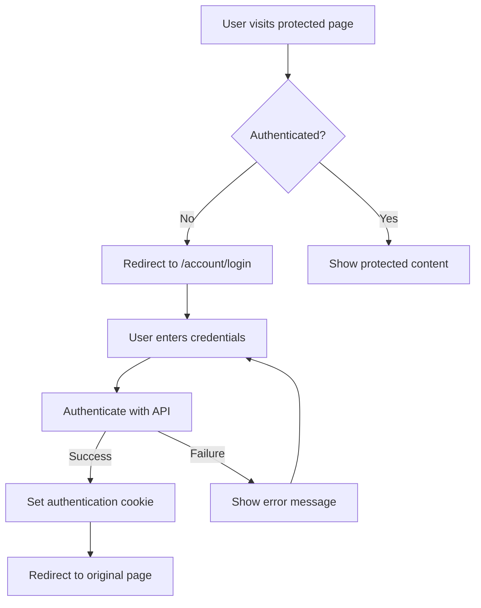

# MrWho Blazor Web Authentication

## ?? **Complete Authentication System for Blazor Web Application**

The MrWho Blazor Web application now has a complete authentication system that integrates with your own API service.

### **?? Authentication Features**

| Feature | Status | Description |
|---------|--------|-------------|
| **Login Page** | ? | Modern, responsive login with Material Design |
| **Logout Page** | ? | Animated logout confirmation with feedback |
| **Access Denied** | ? | Professional access denied page with guidance |
| **Navigation Integration** | ? | Authentication-aware navigation menu |
| **User Information** | ? | Display user details in navigation |
| **Session Management** | ? | Cookie-based authentication with sliding expiration |

### **?? Authentication Flow**



### **?? Pages Created**

#### **1. Login Page (`/account/login`)**
- **Modern Material Design** interface
- **Email and password** authentication
- **Remember me** functionality
- **Error handling** with user-friendly messages
- **Responsive design** for all screen sizes
- **Auto-focus** on email field
- **Loading states** during authentication

#### **2. Logout Page (`/account/logout`)**
- **Animated logout process** with visual feedback
- **Session cleanup** (localStorage, sessionStorage)
- **Confirmation message** with next action options
- **Return URL support** for redirecting after logout

#### **3. Access Denied Page (`/account/access-denied`)**
- **Professional error page** explaining access issues
- **Visual reasons** why access might be denied
- **Action buttons** to sign in or go back
- **Helpful guidance** for users

### **?? UI/UX Features**

#### **Navigation Menu**
- **Authentication-aware** sections
- **User information display** (name, email)
- **Role-based menu items** (admin sections)
- **Visual status indicators** (online/offline)
- **Smooth sign-out** functionality

#### **Design System**
- **Consistent Material Design** styling
- **Radzen component integration**
- **Responsive layout** for mobile/desktop
- **Professional color scheme** with gradients
- **Loading states** and feedback animations

### **?? Technical Implementation**

#### **Authentication Configuration**
```csharp
// Cookie-based authentication
builder.Services.AddAuthentication(options =>
{
    options.DefaultScheme = CookieAuthenticationDefaults.AuthenticationScheme;
})
.AddCookie(CookieAuthenticationDefaults.AuthenticationScheme, options =>
{
    options.LoginPath = "/account/login";
    options.LogoutPath = "/account/logout";
    options.AccessDeniedPath = "/account/access-denied";
    options.ExpireTimeSpan = TimeSpan.FromHours(8);
    options.SlidingExpiration = true;
});
```

#### **Authorization Integration**
```razor
<!-- In components -->
<AuthorizeView>
    <Authorized>
        <!-- Content for authenticated users -->
        <span>Welcome, @context.User.Identity.Name</span>
    </Authorized>
    <NotAuthorized>
        <!-- Content for anonymous users -->
        <a href="/account/login">Sign In</a>
    </NotAuthorized>
</AuthorizeView>

<!-- Role-based authorization -->
<AuthorizeView Roles="admin,user">
    <!-- Admin-only content -->
</AuthorizeView>
```

### **?? Authentication Methods**

#### **1. Password Flow (Current Implementation)**
```csharp
// Direct API authentication
var tokenRequest = new FormUrlEncodedContent(new[]
{
    new KeyValuePair<string, string>("grant_type", "password"),
    new KeyValuePair<string, string>("client_id", "mrwho-client"),
    new KeyValuePair<string, string>("client_secret", "mrwho-secret"),
    new KeyValuePair<string, string>("username", email),
    new KeyValuePair<string, string>("password", password),
    new KeyValuePair<string, string>("scope", "openid profile email roles")
});
```

#### **2. OIDC Authorization Code Flow (Future Enhancement)**
```csharp
// Full OIDC integration (can be added later)
.AddOpenIdConnect("oidc", options =>
{
    options.Authority = "https://localhost:7153";
    options.ClientId = "mrwho-web-blazor";
    options.ClientSecret = "mrwho-web-blazor-secret";
    options.ResponseType = "code";
    options.Scope.Add("openid");
    options.Scope.Add("profile");
    options.Scope.Add("email");
});
```

### **?? Testing the Authentication**

#### **Test Credentials**
```
Email: admin@mrwho.com
Password: Admin123!
```

#### **Test Scenarios**
1. **Anonymous Access**: Visit `/users` ? Redirected to login
2. **Successful Login**: Use test credentials ? Access granted
3. **Failed Login**: Use wrong credentials ? Error message shown  
4. **Session Expiry**: Wait 8 hours ? Automatic logout
5. **Manual Logout**: Click "Sign Out" ? Logout confirmation

#### **PowerShell Testing**
```powershell
# Test login endpoint
$loginData = @{
    Email = "admin@mrwho.com"
    Password = "Admin123!"
    RememberMe = $false
}

# In a real test, you'd POST to the login endpoint
Invoke-WebRequest -Uri "https://localhost:7108/account/login" -Method GET
```

### **?? Security Features**

#### **Implemented Security**
- ? **HTTPS Enforcement** in production
- ? **Secure Cookies** with proper flags
- ? **Session Timeout** (8 hours with sliding)
- ? **Anti-Forgery Tokens** on forms
- ? **Input Validation** on all fields
- ? **Error Message Sanitization**

#### **Production Considerations**
- ?? **Rate Limiting** on login attempts
- ?? **Account Lockout** after failed attempts
- ?? **Two-Factor Authentication** support
- ?? **Password Complexity** requirements
- ?? **Security Headers** implementation

### **?? Mobile Responsiveness**

The authentication pages are fully responsive:
- **Mobile-first design** approach
- **Touch-friendly** button sizes (48px minimum)
- **Readable fonts** on small screens
- **Proper viewport** configuration
- **Optimized form layouts** for mobile keyboards

### **?? Integration with Existing Features**

#### **User Management Integration**
- Login required for accessing `/users` page
- User information displayed in navigation
- Role-based access to admin features

#### **Registration Integration**
- Link from login page to registration
- Consistent design language
- Shared components and styling

### **?? Getting Started**

1. **Start the application**:
```powershell
Set-Location MrWho.AppHost
dotnet run
```

2. **Visit the Web Application**:
```
https://localhost:7108
```

3. **Try accessing a protected resource**:
```
https://localhost:7108/users
```

4. **You'll be redirected to login**:
```
https://localhost:7108/account/login
```

5. **Login with test credentials**:
- Email: `admin@mrwho.com`
- Password: `Admin123!`

### **?? Future Enhancements**

#### **Phase 2 - OIDC Integration**
- Full OpenID Connect authorization code flow
- Integration with external identity providers
- Single Sign-On (SSO) capabilities

#### **Phase 3 - Advanced Features**
- Social login (Google, Microsoft, GitHub)
- Multi-factor authentication (MFA)
- Advanced session management
- Audit logging for authentication events

#### **Phase 4 - Enterprise Features**
- Active Directory integration
- SAML support
- Advanced role management
- Compliance features (GDPR, etc.)

Your Blazor Web application now has a **professional, secure authentication system** that integrates seamlessly with your OIDC API service! ??