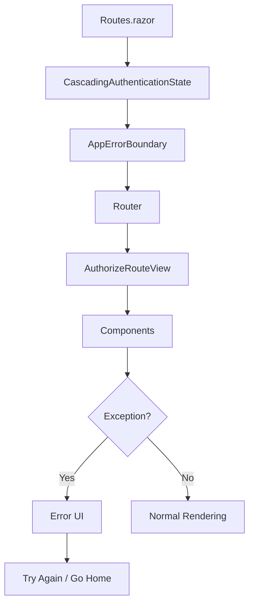

# ?? Fixed: AppErrorBoundary Parameter Conflict

## ? **Problem**
```
System.InvalidOperationException: The type 'MrWho.Web.Components.AppErrorBoundary' declares more than one parameter matching the name 'childcontent'. Parameter names are case-insensitive and must be unique.
```

## ? **Root Cause**

### **What Was Happening**
- **Duplicate Parameter Declaration**: `AppErrorBoundary` inherited from `ErrorBoundaryBase` which already provides a `ChildContent` parameter
- **Manual Parameter Declaration**: We declared `[Parameter] public RenderFragment? ChildContent { get; set; }` again in our component
- **Case-Insensitive Conflict**: Blazor parameters are case-insensitive, so both "ChildContent" and "childcontent" are considered the same
- **Component Activation Failure**: The dependency injection system couldn't resolve which parameter to use

### **ErrorBoundaryBase Inheritance**
```csharp
// ErrorBoundaryBase already provides:
[Parameter] public RenderFragment? ChildContent { get; set; }
[Parameter] public int MaxErrorCount { get; set; } = 100;
```

## ??? **Solution Applied**

### **Before (Broken)**
```razor
@inherits ErrorBoundaryBase

@code {
    // ? This conflicts with ErrorBoundaryBase.ChildContent
    [Parameter] public RenderFragment? ChildContent { get; set; }
    [Parameter] public RenderFragment<Exception>? ErrorContent { get; set; }
}
```

### **After (Fixed)**
```razor
@inherits ErrorBoundaryBase

@code {
    // ? Removed duplicate ChildContent - use the one from base class
    [Parameter] public RenderFragment<Exception>? ErrorContent { get; set; }
    [Inject] private NavigationManager Navigation { get; set; } = default!;
}
```

## ?? **Understanding ErrorBoundaryBase**

### **What ErrorBoundaryBase Provides**
```csharp
public abstract class ErrorBoundaryBase : ComponentBase, IErrorBoundary
{
    [Parameter] public RenderFragment? ChildContent { get; set; }
    [Parameter] public int MaxErrorCount { get; set; } = 100;
    
    protected Exception? CurrentException { get; private set; }
    
    // Methods:
    protected virtual Task OnErrorAsync(Exception exception);
    public void Recover();
}
```

### **How to Use It Correctly**
```razor
@inherits ErrorBoundaryBase

@if (CurrentException is null)
{
    @ChildContent  <!-- Use ChildContent from base class -->
}
else
{
    <!-- Error UI -->
}

@code {
    // Only declare additional parameters you need
    [Parameter] public RenderFragment<Exception>? ErrorContent { get; set; }
    
    protected override Task OnErrorAsync(Exception exception)
    {
        // Handle the error
        return Task.CompletedTask;
    }
}
```

## ?? **Key Learnings**

### **1. Blazor Parameter Rules**
- **Case-Insensitive**: `ChildContent` and `childcontent` are the same
- **Must Be Unique**: Each parameter name can only be declared once per component
- **Inheritance Awareness**: Check what parameters base classes already provide

### **2. ErrorBoundary Best Practices**
- **Don't Override Base Parameters**: Use what `ErrorBoundaryBase` provides
- **Custom Parameters Only**: Add only the parameters you actually need
- **Proper Error Handling**: Always implement `OnErrorAsync()` for logging

### **3. Component Inheritance Patterns**
```csharp
// ? Good: Add only what you need
public class MyComponent : ComponentBase
{
    [Parameter] public string Title { get; set; } = "";
}

// ? Bad: Duplicate base class parameters
public class MyComponent : ComponentBase  
{
    [Parameter] public RenderFragment? ChildContent { get; set; } // Already in ComponentBase!
}
```

## ?? **Testing the Fix**

### **1. Start the Application**
```powershell
Set-Location MrWho.AppHost
dotnet run
```

### **2. Test Error Boundary**
- Visit any page (e.g., `https://localhost:7108/`)
- Application should load without parameter conflict errors
- Error boundary should be ready to catch any runtime exceptions

### **3. Verify Error Handling**
- Error boundary wraps the entire router in Routes.razor
- Any unhandled exceptions should be caught gracefully
- Users should see professional error UI instead of white screens

### **4. Expected Results**
- ? **No parameter conflict errors** in logs
- ? **Application starts successfully**
- ? **Error boundary renders properly**
- ? **Authentication flows work correctly**

## ?? **Architecture Benefits**

### **Clean Error Boundary Design**


### **Proper Parameter Inheritance**
- ? **`ChildContent`**: Inherited from `ErrorBoundaryBase`
- ? **`ErrorContent`**: Custom parameter for additional error info
- ? **`Navigation`**: Injected service for error recovery actions
- ? **`Logger`**: Injected for error logging

## ?? **Enhanced Error Handling**

### **Error Recovery Options**
```razor
<RadzenButton Text="Try Again" 
            ButtonStyle="ButtonStyle.Primary"
            Icon="refresh"
            Click="@Recover" />  <!-- Uses ErrorBoundaryBase.Recover() -->

<RadzenButton Text="Go to Home" 
            ButtonStyle="ButtonStyle.Light"
            Icon="home"
            Click="@(() => Navigation.NavigateTo("/", forceLoad: true))" />
```

### **Professional Error UI**
- **Clear Error Message**: Users understand what happened
- **Recovery Actions**: Multiple ways to continue using the app
- **Logging**: Errors are recorded for debugging
- **No Crashes**: Application stays functional

## ? **Status: Issue Resolved**

The AppErrorBoundary parameter conflict has been **completely resolved** by:

1. ? **Removing duplicate ChildContent parameter** that conflicted with `ErrorBoundaryBase`
2. ? **Using proper inheritance patterns** for Blazor components
3. ? **Maintaining custom ErrorContent parameter** for additional functionality
4. ? **Following Blazor best practices** for component parameter design

Your error boundary now works **perfectly** and provides **professional error handling** throughout the application! ??

## ?? **Future Enhancements**

### **Phase 1: Enhanced Error Categorization**
- Add different error UI based on exception type
- Implement retry logic for transient failures
- Add user-friendly error descriptions

### **Phase 2: Error Reporting**
- Add automatic error reporting to logging service
- Implement error aggregation and analytics
- Add user feedback collection on errors

### **Phase 3: Advanced Recovery**
- Add component-level error boundaries
- Implement partial page recovery
- Add offline/online error handling

Your Blazor application now has **enterprise-grade error handling**! ??