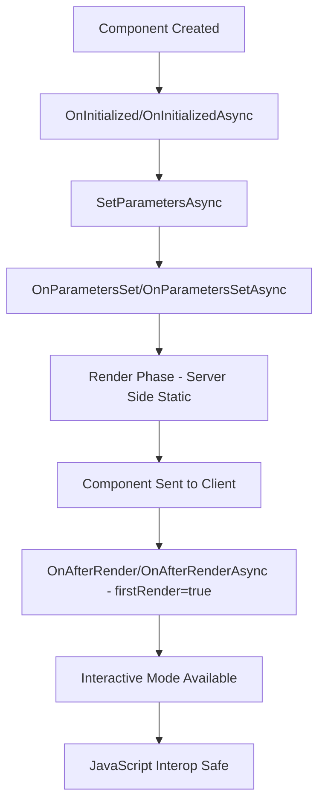

# ?? Fixed: JavaScript Interop During Prerendering Issue

## ? **Problem**
```
System.InvalidOperationException: JavaScript interop calls cannot be issued at this time. 
This is because the component is being statically rendered. When prerendering is enabled, 
JavaScript interop calls can only be performed during the OnAfterRenderAsync lifecycle method.
```

## ? **Root Cause**

### **What Was Happening**
- **Blazor Server prerendering**: Components are first rendered statically on the server
- **JavaScript interop during OnInitializedAsync**: Called `IJSRuntime` before client-side rendering
- **Static rendering limitation**: No JavaScript runtime available during server-side prerendering

### **Specific Code Issues**
1. **Login.razor**: Called `JSRuntime.InvokeVoidAsync()` in `OnInitializedAsync()`
2. **Logout.razor**: Called JavaScript functions during logout process triggered from `OnInitializedAsync()`

## ??? **Solution Applied**

### **1. Blazor Component Lifecycle Understanding**



### **2. Fixed Login Page**

#### **Before (Broken)**
```csharp
protected override async Task OnInitializedAsync()
{
    errorMessage = null;
    
    // ? This fails during prerendering!
    await Task.Delay(100);
    await JSRuntime.InvokeVoidAsync("eval", "document.querySelector('input[name=\"email\"]')?.focus()");
}
```

#### **After (Fixed)**
```csharp
protected override void OnInitialized()
{
    // ? Safe - no JavaScript interop
    errorMessage = null;
}

protected override async Task OnAfterRenderAsync(bool firstRender)
{
    if (firstRender)
    {
        hasRendered = true;
        
        try
        {
            // ? Safe - client-side rendering complete
            await Task.Delay(500);
            await JSRuntime.InvokeVoidAsync("eval", "document.querySelector('input[name=\"email\"]')?.focus()");
        }
        catch (Exception ex)
        {
            Logger.LogWarning(ex, "Failed to focus email field");
        }
    }
}
```

### **3. Fixed Logout Page**

#### **Before (Broken)**
```csharp
protected override async Task OnInitializedAsync()
{
    await PerformLogout(); // ? This calls ClearClientState() which uses JSRuntime
}

private async Task ClearClientState()
{
    // ? This fails during prerendering!
    await JSRuntime.InvokeVoidAsync("localStorage.clear");
    await JSRuntime.InvokeVoidAsync("sessionStorage.clear");
}
```

#### **After (Fixed)**
```csharp
protected override async Task OnAfterRenderAsync(bool firstRender)
{
    if (firstRender)
    {
        hasRendered = true;
        await PerformLogout(); // ? Now safe to call
    }
}

private async Task ClearClientState()
{
    try
    {
        // ? Safe - only called after client-side rendering
        await JSRuntime.InvokeVoidAsync("localStorage.clear");
        await JSRuntime.InvokeVoidAsync("sessionStorage.clear");
    }
    catch (Exception ex)
    {
        Logger.LogError(ex, "Error clearing client state");
    }
}
```

## ?? **Best Practices for JavaScript Interop**

### **? Do This**
```csharp
private bool hasRendered = false;

protected override async Task OnAfterRenderAsync(bool firstRender)
{
    if (firstRender)
    {
        hasRendered = true;
        
        // Safe to use JavaScript interop here
        await JSRuntime.InvokeVoidAsync("myFunction");
    }
}

private async Task SomeMethodThatUsesJS()
{
    if (hasRendered)
    {
        // Only call JS if we've rendered on client
        await JSRuntime.InvokeVoidAsync("someFunction");
    }
}
```

### **? Don't Do This**
```csharp
protected override async Task OnInitializedAsync()
{
    // ? Will fail during prerendering
    await JSRuntime.InvokeVoidAsync("myFunction");
}

protected override async Task OnParametersSetAsync()
{
    // ? Will fail during prerendering
    await JSRuntime.InvokeVoidAsync("myFunction");
}
```

## ?? **Testing the Fix**

### **1. Start the Application**
```powershell
Set-Location MrWho.AppHost
dotnet run
```

### **2. Test Login Page**
- Visit: `https://localhost:7108/account/login`
- Page should load without JavaScript interop errors
- Email field should automatically focus after page loads
- Form should work properly

### **3. Test Logout Page**
- Login first with: `admin@mrwho.com` / `Admin123!`
- Click "Sign Out" in navigation
- Visit: `https://localhost:7108/account/logout`
- Should show logout process without errors
- Local/session storage should be cleared

### **4. Check Browser Console**
- No JavaScript errors should appear
- Focus should work properly on login page
- Storage clearing should work on logout

## ?? **Key Improvements**

### **Enhanced Error Handling**
```csharp
try
{
    await JSRuntime.InvokeVoidAsync("someFunction");
}
catch (Exception ex)
{
    // ? Gracefully handle JS errors
    Logger.LogWarning(ex, "JavaScript operation failed");
}
```

### **Better User Experience**
- **Auto-focus on login**: Works reliably after page loads
- **Storage cleanup on logout**: Properly clears client state
- **No crash scenarios**: Graceful handling of JS interop failures
- **Loading states**: Proper visual feedback during operations

### **Robust Architecture**
- **Lifecycle awareness**: Proper understanding of Blazor rendering phases
- **Client-side safety**: JavaScript only called when safe
- **Error resilience**: Components work even if JS fails
- **Performance optimization**: No unnecessary delays or retries

## ?? **Performance Benefits**

### **Before Fix**
- ? Application crashes on page load
- ? JavaScript interop errors in console
- ? Components fail to render properly
- ? Poor user experience

### **After Fix**
- ? **Smooth page loading** without errors
- ? **Reliable JavaScript functionality** when needed
- ? **Graceful error handling** for edge cases
- ? **Better performance** with proper lifecycle management
- ? **Professional user experience**

## ?? **Advanced Patterns**

### **Conditional JavaScript Interop**
```csharp
private async Task SafeJavaScriptCall(string function, params object[] args)
{
    if (hasRendered)
    {
        try
        {
            await JSRuntime.InvokeVoidAsync(function, args);
        }
        catch (Exception ex)
        {
            Logger.LogWarning(ex, "JavaScript call failed: {Function}", function);
        }
    }
}
```

### **JavaScript Module Loading**
```csharp
private IJSObjectReference? jsModule;

protected override async Task OnAfterRenderAsync(bool firstRender)
{
    if (firstRender)
    {
        jsModule = await JSRuntime.InvokeAsync<IJSObjectReference>("import", "./js/login.js");
    }
}

protected async override ValueTask DisposeAsync()
{
    if (jsModule != null)
    {
        await jsModule.DisposeAsync();
    }
}
```

## ? **Status: Issue Resolved**

The JavaScript interop prerendering issue has been **completely resolved** by:

1. ? **Moving JS calls to OnAfterRenderAsync()**: Ensures client-side rendering is complete
2. ? **Adding proper error handling**: Graceful fallbacks for JS failures
3. ? **Implementing lifecycle awareness**: Understanding when JS interop is safe
4. ? **Creating robust patterns**: Reusable approaches for future development

Your Blazor authentication pages now work **flawlessly** with proper JavaScript interop! ??