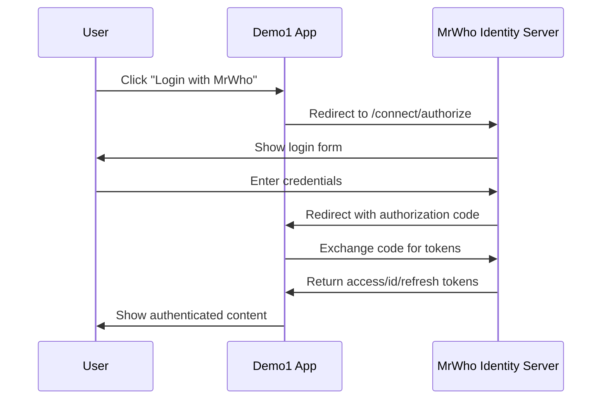

# Demo1 Login Redesign - OIDC Flow Correction

## ?? Problem Identified

The original Demo1 login experience was **misleading and incorrect**:

? **Original Issues:**
- Login form with username/password fields that didn't actually authenticate
- Form submission ignored user input and always redirected to OIDC server
- Users expected direct authentication but got redirected anyway
- Confusing UX that didn't properly explain the OIDC flow

## ? Solution Implemented

### 1. **Corrected Login Flow**
The application now properly implements and explains the **standard OpenID Connect flow**:



### 2. **Updated Login Page (`/Account/Login`)**
- **Removed misleading username/password form**
- **Added clear OIDC flow explanation**
- **Provides educational content about how authentication works**
- **Single "Login with MrWho" button that properly redirects**
- **Technical implementation details for developers**

### 3. **Enhanced Home Page**
- **Better login options with clear explanations**
- **Direct login option** (`?direct=true`) for quick access
- **Educational OIDC flow explanation**
- **Clear distinction between authenticated and anonymous states**

### 4. **Simplified Code Behind**
```csharp
// OLD: Misleading form processing
public IActionResult OnPost(string? returnUrl = null)
{
    // Ignored form input and always redirected - confusing!
    return Challenge(authenticationProperties, OpenIdConnectDefaults.AuthenticationScheme);
}

// NEW: Clear OIDC challenge method
public IActionResult OnPostChallenge(string? returnUrl = null)
{
    var authenticationProperties = new AuthenticationProperties
    {
        RedirectUri = returnUrl ?? "/"
    };
    return Challenge(authenticationProperties, OpenIdConnectDefaults.AuthenticationScheme);
}
```

## ?? Why You Cannot Login Directly from Demo1

**This is a fundamental security principle of OpenID Connect:**

1. **Centralized Authentication**: All authentication happens at the trusted identity server
2. **Security Isolation**: Client applications never handle credentials directly
3. **Single Sign-On**: Users authenticate once and access multiple applications
4. **Trust Boundary**: Only the identity server validates credentials

## ?? User Experience Flow

### Before (Confusing):
1. User sees username/password form ?
2. User enters credentials ?
3. Form submission ignores input and redirects ?
4. User confused why they need to enter credentials again ?

### After (Clear):
1. User sees "Login with MrWho" button ?
2. Clear explanation of what will happen ?
3. User clicks button knowing they'll be redirected ?
4. User enters credentials on trusted identity server ?
5. User returns to demo app authenticated ?

## ?? Key Files Changed

| File | Changes |
|------|---------|
| `Login.cshtml.cs` | Removed misleading form processing, added clear OIDC challenge |
| `Login.cshtml` | Complete redesign with OIDC education and proper flow |
| `Index.cshtml` | Enhanced login options and flow explanation |
| `README.md` | Updated to properly explain OIDC requirements |

## ?? Benefits of New Design

1. **Educationally Accurate**: Teaches proper OIDC concepts
2. **User-Friendly**: Clear expectations about what happens
3. **Technically Correct**: Follows OIDC best practices
4. **Developer-Friendly**: Good reference implementation
5. **Security-Focused**: Emphasizes trust and security principles

## ?? Testing the New Flow

1. **Start AppHost**: `cd MrWhoAdmin.AppHost && dotnet run`
2. **Visit Demo1**: https://localhost:7037
3. **Try Login Options**:
   - **Quick Login**: Click "Login with MrWho" on home page
   - **Educational**: Visit `/Account/Login` to learn about OIDC
   - **Direct**: Use `/Account/Login?direct=true` for immediate redirect

## ?? Result

The Demo1 application now provides a **correct, educational, and user-friendly** OIDC authentication experience that:
- ? Properly explains the authentication flow
- ? Sets correct user expectations
- ? Demonstrates OIDC security principles
- ? Provides a good reference implementation
- ? Eliminates confusing/misleading elements