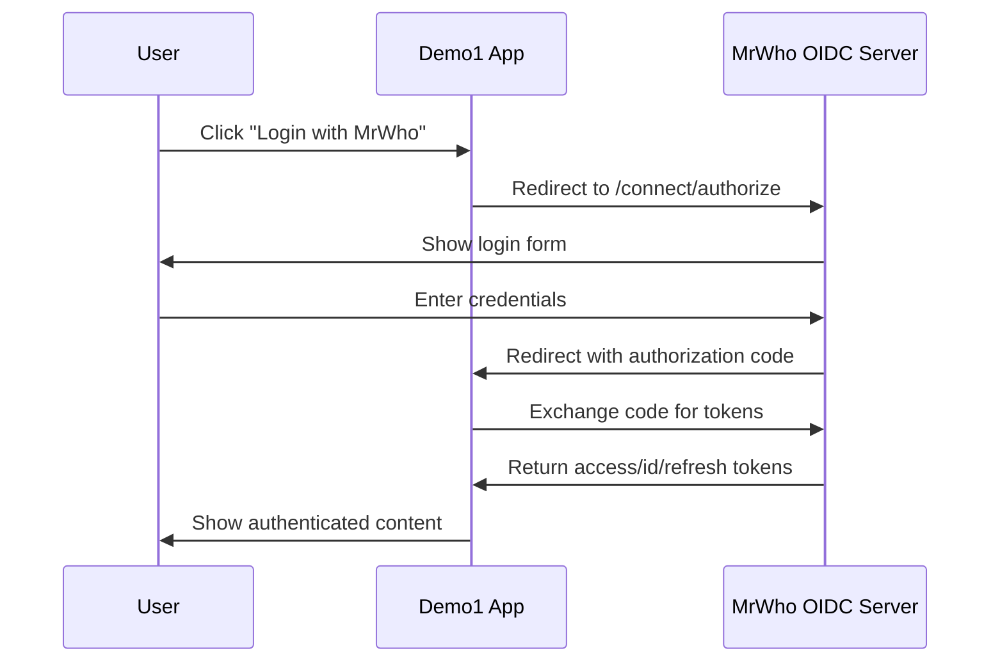

# MrWho Demo Application 1

This is a demo Razor Pages application that showcases **OpenID Connect (OIDC) authentication** integration with the MrWho OIDC Server.

## ?? How Authentication Works

This demo follows the **standard OpenID Connect flow** - you **cannot login directly** from the demo app. Instead:

1. **Redirect to Identity Server**: When you click login, you're redirected to the MrWho Identity Server
2. **Authenticate at Identity Server**: Enter your credentials on the secure, trusted identity server  
3. **Return with Tokens**: After successful authentication, you're redirected back with tokens
4. **Access Demo Features**: Explore the application with your authenticated session

> **Note**: The username/password fields in traditional web forms are misleading in OIDC applications. Authentication **must** happen at the identity server for security.

## ?? Demo Credentials

Use these credentials when redirected to the MrWho Identity Server:

- **Username**: `demo1@example.com`
- **Password**: `Demo123`

## ?? Application URLs

- **Demo App**: https://localhost:7037
- **MrWho OIDC Server**: https://localhost:7113  
- **MrWho Admin Interface**: https://localhost:7257

## ????? Getting Started

1. **Start the applications** using the AppHost:
   ```bash
   cd MrWhoAdmin.AppHost
   dotnet run
   ```

2. **Access the demo application**:
   - Navigate to https://localhost:7037
   - Click **"Login with MrWho"** to start authentication

3. **Complete the OIDC flow**:
   - You'll be redirected to the MrWho Identity Server (https://localhost:7113)
   - Enter the demo credentials: `demo1@example.com` / `Demo123`
   - You'll be automatically redirected back to the demo app

4. **Explore authenticated features**:
   - View access tokens, refresh tokens, and ID tokens
   - Inspect user claims from the identity provider
   - Test logout functionality

## ?? Technical Details

### Client Configuration

- **Client ID**: `mrwho_demo1`
- **Client Secret**: `FTZvvlIIFdmtBg7IdBql9EEXRDj1xwLmi1qW9fGbJBY`
- **Realm**: `demo`
- **Client Type**: Confidential
- **Flows**: Authorization Code Flow with PKCE
- **Scopes**: `openid`, `profile`, `email`, `roles`, `offline_access`

### Authentication Configuration

The application uses:
- **ASP.NET Core Authentication** with OpenID Connect
- **Cookie Authentication** for local session management
- **PKCE** for enhanced security
- **Token Persistence** for demonstration purposes

### OIDC Flow Details



## ??? Debug Endpoints

Access debug information:
- **Demo1 Auth Status**: https://localhost:7037/debug/auth
- **Demo1 Tokens**: https://localhost:7037/debug/tokens  
- **Demo1 Logout Flow**: https://localhost:7037/debug/logout-flow
- **MrWho OIDC Config**: https://localhost:7113/.well-known/openid-configuration
- **Demo1 Client Info**: https://localhost:7113/debug/demo1-client-info

## ?? Project Structure

```
MrWhoDemo1/
??? Pages/
?   ??? Account/           # OIDC login/logout handling
?   ??? Shared/           # Layout files  
?   ??? Index.cshtml      # Home page with token display
??? Program.cs            # OIDC authentication configuration
??? MrWhoDemo1.csproj     # Project file
```

## ?? Security Features

- **PKCE (Proof Key for Code Exchange)**: Enhanced security for authorization code flow
- **State Parameter**: Prevents CSRF attacks during authentication
- **HTTPS Only**: All communication uses HTTPS
- **Secure Cookies**: Authentication cookies with proper security settings
- **Token Validation**: Proper validation of tokens from the OIDC server
- **No Direct Authentication**: Credentials never touch the client application

## ?? Demo Data

The MrWho OIDC Server automatically creates:
- **Demo Realm**: Named "demo" for demo applications
- **Demo1 Client**: Pre-configured for this application  
- **Demo1 User**: `demo1@example.com` with password `Demo123`

## ?? Troubleshooting

### Common Issues

1. **"Login form doesn't work"**: This is expected! OIDC requires redirect to identity server
2. **Redirect URI Mismatch**: Ensure the demo app runs on port 7037
3. **HTTPS Certificate**: Accept development certificates when prompted
4. **Authentication Failures**: Check the debug endpoints for client configuration

### Authentication Flow Issues

If authentication fails:
1. Check console logs for OIDC errors
2. Verify MrWho server is running on port 7113
3. Confirm demo user exists using admin interface
4. Test the discovery endpoint: https://localhost:7113/.well-known/openid-configuration

## ? Quick Actions

- **Fast Login**: Visit https://localhost:7037/Account/Login?direct=true
- **Learn OIDC**: Visit https://localhost:7037/Account/Login  
- **Debug Auth**: Visit https://localhost:7037/debug/auth

## ?? Development Notes

- Uses Razor Pages with .NET 9
- Bootstrap 5 with Bootstrap Icons for UI
- Aspire for service orchestration and dependencies
- Development certificates for HTTPS
- Standard OpenID Connect implementation (no custom authentication)

This demo application serves as a reference implementation for integrating with OIDC providers and demonstrates proper security practices for modern web applications.