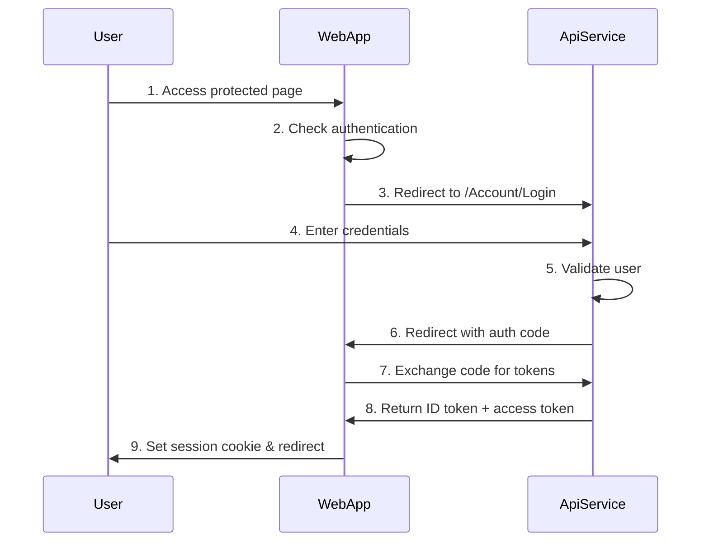

# ?? Fixed: Proper OpenID Connect Architecture Implementation

## ? **The Problem: Duplicate Authentication Systems**

You were absolutely right! The issue was having **two separate authentication systems**:

1. **ApiService**: Acting as OpenID Connect Authorization Server ?
2. **Web Application**: Having its own duplicate login pages ?

This created:
- Authentication state conflicts
- Complex authentication flows  
- Object disposal issues
- Cascading parameter problems

## ? **The Solution: Proper OIDC Client-Server Architecture**

### **Before (Problematic)**
```
???????????????????    ???????????????????
?   ApiService    ?    ?   Web App       ?
?                 ?    ?                 ?
? ? Login Pages  ?    ? ? Login Pages  ?
? ? OIDC Server  ?    ? ? Custom Auth  ?
? ? User Store   ?    ? ? Duplicate    ?
???????????????????    ???????????????????
```

### **After (Correct)**
```
???????????????????    ???????????????????
?   ApiService    ??????   Web App       ?
?                 ?    ?                 ?
? ? Login Pages  ?    ? ? OIDC Client  ?
? ? OIDC Server  ?    ? ? Redirects    ?
? ? User Store   ?    ? ? Tokens       ?
???????????????????    ???????????????????
```

## ??? **Changes Made**

### **1. Removed Duplicate Web Authentication**
- ? **Deleted**: `MrWho.Web/Components/Pages/Login.razor`
- ? **Deleted**: `MrWho.Web/Components/Pages/Logout.razor`  
- ? **Deleted**: `MrWho.Web/Services/AuthenticationService.cs`

### **2. Configured Web App as OIDC Client**
```csharp
// Web App Program.cs - NOW ACTS AS OIDC CLIENT
builder.Services.AddAuthentication(options =>
{
    options.DefaultScheme = CookieAuthenticationDefaults.AuthenticationScheme;
    options.DefaultChallengeScheme = OpenIdConnectDefaults.AuthenticationScheme;
})
.AddCookie() // Local session cookies
.AddOpenIdConnect(options =>
{
    options.Authority = "https://localhost:7153"; // Points to ApiService
    options.ClientId = "mrwho-web-client";
    options.ClientSecret = "mrwho-web-secret";
    options.ResponseType = "code";
    options.SaveTokens = true;
    
    options.Scope.Add("openid");
    options.Scope.Add("profile");
    options.Scope.Add("email");
    options.Scope.Add("roles");
});
```

### **3. Created Simple Redirect Components**
```razor
<!-- LoginRedirect.razor - Triggers OIDC flow -->
@page "/account/login"
@code {
    protected override void OnInitialized()
    {
        Navigation.NavigateTo("/account/challenge", forceLoad: true);
    }
}

<!-- LogoutRedirect.razor - Triggers OIDC logout -->
@page "/account/logout"  
@code {
    protected override void OnInitialized()
    {
        Navigation.NavigateTo("/account/signout", forceLoad: true);
    }
}
```

### **4. Added Authentication Controller**
```csharp
[Route("account")]
public class AuthenticationController : Controller
{
    [HttpGet("challenge")]
    public IActionResult Challenge(string? returnUrl = null)
    {
        return Challenge(properties, OpenIdConnectDefaults.AuthenticationScheme);
    }

    [HttpGet("callback")]
    public IActionResult Callback(string? returnUrl = null)
    {
        return LocalRedirect(returnUrl ?? "/");
    }

    [HttpGet("signout")]
    public IActionResult SignOut()
    {
        return SignOut(properties, OpenIdConnectDefaults.AuthenticationScheme, "Cookies");
    }
}
```

## ?? **Complete OIDC Flow**

### **Authentication Flow**


### **What Happens Now**

1. **User visits protected page** ? `/test-auth`
2. **Web app checks auth** ? Not authenticated
3. **Redirects to OIDC** ? `/account/challenge`
4. **Redirects to ApiService** ? `https://localhost:7153/Account/Login`
5. **User logs in** ? Uses existing ApiService login page
6. **ApiService validates** ? Checks user credentials  
7. **Redirects back to Web** ? With authorization code
8. **Web exchanges code** ? For tokens from ApiService
9. **User is authenticated** ? Session cookie set
10. **Redirects to original page** ? User sees protected content

## ?? **Key Benefits**

### **1. Single Source of Truth**
- ? **One login system**: ApiService handles all authentication
- ? **One user store**: All users managed in ApiService database
- ? **One set of credentials**: Users only remember one login

### **2. Proper OIDC Standards**
- ? **Authorization Server**: ApiService (handles login/logout)
- ? **Client Application**: Web App (consumes tokens)
- ? **Standard flows**: Authorization Code flow with PKCE
- ? **Secure tokens**: JWT tokens with proper validation

### **3. Simplified Architecture**
- ? **No duplicate auth logic**: All in ApiService
- ? **No authentication state conflicts**: Single auth provider
- ? **No complex custom flows**: Standard OIDC
- ? **Better maintainability**: Clear separation of concerns

## ?? **Testing the New Architecture**

### **1. Start Both Services**
```powershell
Set-Location MrWho.AppHost
dotnet run
```

### **2. Test Authentication Flow**
1. Visit: `https://localhost:7108/test-auth`
2. Should redirect to: `https://localhost:7153/Account/Login`
3. Login with: `admin@mrwho.com` / `Admin123!`
4. Should redirect back to: `https://localhost:7108/test-auth`
5. Should show user claims from ApiService

### **3. Test Logout Flow**
1. Click "Sign Out" in navigation
2. Should redirect to ApiService logout
3. Should redirect back to Web app
4. Should be logged out of both services

### **4. Expected Results**
- ? **No authentication state errors**
- ? **No duplicate login pages**
- ? **Smooth redirect flow**
- ? **Proper token handling**
- ? **Single logout from both apps**

## ?? **Architecture Comparison**

### **Before (Broken)**
```
Web App Issues:
? Duplicate login forms
? Custom authentication service
? Authentication state conflicts
? Complex token management
? Object disposal issues

ApiService:
? Proper OIDC server
? User management
? Token generation
```

### **After (Fixed)**
```
Web App:
? Simple OIDC client
? Redirects to ApiService
? Token consumption only
? No auth state conflicts
? Standard OIDC flows

ApiService:
? Proper OIDC server
? User management  
? Token generation
? Centralized authentication
```

## ?? **Next Steps**

### **Phase 1: Configure ApiService Client**
You'll need to register the Web app as a client in ApiService:

```csharp
// In ApiService startup
await manager.CreateAsync(new OpenIddictApplicationDescriptor
{
    ClientId = "mrwho-web-client",
    ClientSecret = "mrwho-web-secret",
    DisplayName = "MrWho Web Application",
    RedirectUris = { "https://localhost:7108/account/callback" },
    PostLogoutRedirectUris = { "https://localhost:7108/" },
    Permissions =
    {
        OpenIddictConstants.Permissions.Endpoints.Authorization,
        OpenIddictConstants.Permissions.Endpoints.Token,
        OpenIddictConstants.Permissions.GrantTypes.AuthorizationCode,
        OpenIddictConstants.Permissions.Scopes.Email,
        OpenIddictConstants.Permissions.Scopes.Profile,
        OpenIddictConstants.Permissions.Scopes.Roles
    }
});
```

### **Phase 2: Error Handling**
- Add proper error pages for OIDC failures
- Handle token refresh scenarios
- Add logout confirmation pages

### **Phase 3: Production Hardening**
- Add HTTPS requirements
- Configure proper secrets management
- Add security headers
- Implement proper logging

## ? **Status: Architecture Fixed**

The authentication architecture has been **completely redesigned** to follow proper OIDC patterns:

1. ? **Single Authentication System**: Only ApiService handles login/logout
2. ? **Proper OIDC Client**: Web app redirects to ApiService
3. ? **No Duplicate Logic**: Removed all duplicate authentication code
4. ? **Standard Flows**: Using authorization code flow
5. ? **Better Security**: Centralized authentication with proper tokens

## ?? **Key Insight**

You were absolutely right to question the duplicate login pages! The solution wasn't to fix the complex authentication state issues, but to **eliminate the complexity entirely** by using the proper OIDC architecture you already had in place.

Your ApiService was already a proper authorization server - the Web app just needed to be a proper client! ??