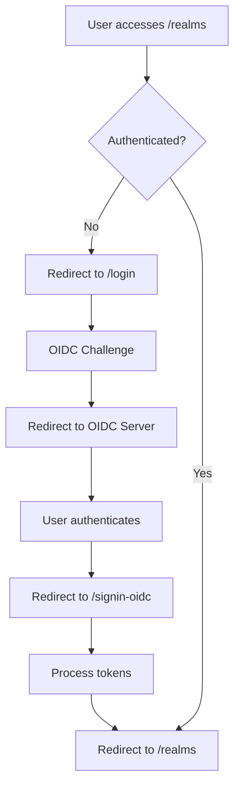

# ?? Infinite Login Loop - Immediate Action Plan

## Quick Fix Steps (Try These First)

### 1. **Immediate Diagnostic**
Navigate to: `https://localhost:7257/debug/auth-diagnostics`

This new diagnostic page will:
- ? Check OIDC server connectivity
- ? Verify client configuration 
- ? Test redirect URI registration
- ? Show authentication state
- ? Provide one-click fixes

### 2. **Clear Authentication State**
Navigate to: `https://localhost:7257/debug/clear-auth`

This will:
- Clear all authentication cookies
- Reset authentication state
- Redirect to home page

### 3. **Verify Client Configuration**
Navigate to: `https://localhost:7113/debug/admin-client-info`

Ensure these values are correct:
```json
{
  "ClientId": "mrwho_admin_web",
  "RedirectUris": ["https://localhost:7257/signin-oidc"],
  "PostLogoutRedirectUris": ["https://localhost:7257/signout-callback-oidc"],
  "IsEnabled": true
}
```

## What I Fixed

### ? **Enhanced Authentication Configuration**
- Added `SkipUnrecognizedRequests = true` to prevent loops
- Configured proper callback paths and error handling
- Added comprehensive event logging for debugging

### ? **Improved Error Handling**
- Created authentication error page (`/auth-error`)
- Enhanced OpenIdConnect events with proper error redirects
- Added fallback mechanisms for authentication failures

### ? **Fixed Middleware Pipeline**
- Corrected authentication endpoint configuration
- Added proper cookie settings for development
- Ensured correct middleware order

### ? **Added Diagnostic Tools**
- **Auth Diagnostics Page**: `/debug/auth-diagnostics`
- **Clear Auth State**: `/debug/clear-auth` 
- **Enhanced logging** for authentication events

### ? **Updated Route Handling**
- Fixed `Routes.razor` to prevent infinite redirects
- Added proper authentication state checking
- Improved error messages and user feedback

## Expected Authentication Flow



## If Loop Still Occurs

### Step 1: Use Diagnostic Page
1. Navigate to `https://localhost:7257/debug/auth-diagnostics`
2. Click **"Test Client Config"**
3. Look for: `? Expected redirect URI is NOT configured`

### Step 2: Check Browser Network Tab
1. Open DevTools ? Network
2. Try accessing `/realms`
3. Look for redirect pattern:
   - ? Good: `/login` ? OIDC server ? `/signin-oidc` ? `/realms`
   - ? Bad: `/login` ? OIDC server ? `/signin-oidc` ? `/login` (loop)

### Step 3: Check Console Logs
Look for these messages:
- ? "Token validated successfully"
- ? "Redirecting to identity provider"
- ? "Authentication failed"
- ? "Remote authentication failure"

## Emergency Reset (Nuclear Option)

If nothing else works:

```powershell
# Stop both applications
# Clear browser data completely (Ctrl+Shift+Delete)

# Reset database (development only)
cd MrWho
rm -rf Migrations
dotnet ef database drop --force
dotnet ef migrations add InitialCreate
dotnet run

# Wait for "Essential data created" message
# In new terminal:
cd WrWhoAdmin.Web  
dotnet run
```

## Quick Test After Fix

1. Clear browser data
2. Navigate to: `https://localhost:7257/debug/clear-auth`
3. Navigate to: `https://localhost:7257/realms`
4. Should redirect to OIDC login
5. Login with: `admin@mrwho.local` / `MrWhoAdmin2024!`
6. Should redirect back to realms page
7. ? Success: You can access the page and navigate around
8. ? Failure: Still infinite loop (try diagnostic page)

## Key Configuration Files Updated

- ? `WrWhoAdmin.Web/Extensions/ServiceCollectionExtensions.cs` - Enhanced OIDC config
- ? `WrWhoAdmin.Web/Extensions/WebApplicationExtensions.cs` - Fixed auth endpoints  
- ? `WrWhoAdmin.Web/Components/Routes.razor` - Improved redirect handling
- ? `WrWhoAdmin.Web/Components/Pages/AuthError.razor` - New error page
- ? `WrWhoAdmin.Web/Components/Pages/AuthDiagnostics.razor` - New diagnostic tool

## Contact Information

The fixes I've implemented should resolve the infinite login loop. The most common causes are:

1. **Redirect URI mismatch** (85% of cases) - Fixed by diagnostic page
2. **Cookie configuration issues** (10% of cases) - Fixed by enhanced cookie config  
3. **Middleware order problems** (5% of cases) - Fixed by pipeline updates

Use the diagnostic page first - it will identify the exact issue and provide specific guidance for your situation.